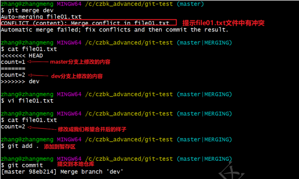

# **git学习**

git诞生于linux开发时期，用于对linux的分布式开发进行管理，设计之初有以下几个目标也就是git的

# 1、特性

1. 速度 
2. 简单的设计 
3. 对非线性开发模式的强力支持（允许成千上万个并行开发的分支） 
4. 完全分布式 
5. 有能力高效管理类似 Linux 内核一样的超大规模项目（速度和数据量）

# 2、安装与配置

## 2.1基本配置

1. 打开Git Bash 

2. 设置用户信息 

   ```
   git config --global user.name “” 
   git config --global user.email “”
   ```

3. 查看配置信息

   ```
   git config --global user.name
   git config --global user.email
   ```

   

## 2.2常用指令配置别名（可选）

1. \打开用户目录，创建 .bashrc 文件 部分windows系统不允许用户创建点号开头的文件，可以打开gitBash,执行 touch ~/.bashrc

2. 在 .bashrc 文件中输入如下内容：

   ```
   #用于输出git提交日志
   alias git-log='git log --pretty=oneline --all --graph --abbrev-commit'
   #用于输出当前目录所有文件及基本信息
   alias ll='ls -al'
   ```

3. 打开gitBash，执行 source ~/.bashrc

## 2.3 解决GitBash乱码问题

1. 打开GitBash执行下面命令

   ```
   git config --global core.quotepath false
   ```

2. ${git_home}/etc/bash.bashrc 文件最后加入下面两行

   ```
   export LANG="zh_CN.UTF-8"
   export LC_ALL="zh_CN.UTF-8"
   ```

# 3、git的基本命令与使用

## 3.1获取本地仓库

1. 在电脑的任意位置创建一个空目录（例如test）作为我们的本地Git仓库
2. 进入这个目录中，点击右键打开Git bash窗口
3. 执行命令git init
4. 如果创建成功后可在文件夹下看到隐藏的.git目录。

## 3.2基础操作指令

Git工作目录下对于文件的修改(增加、删除、更新)会存在几个状态，这些修改的状态会随着我们执行Git 的命令而发生变化。

1. git add (工作区 --> 暂存区)
2. git commit (暂存区 --> 本地仓库)

### 3.2.1查看修改的状态（status）

- 作用：查看的修改的状态（暂存区、工作区） 
- 命令形式：git status

### 3.2.2添加工作区到暂存区(add)

- 作用：添加工作区一个或多个文件的修改到暂存区 

- 命令形式：git add 单个文件名|通配符

- 将所有修改加入暂存区：

  ```
  git add .
  ```

### 3.2.3提交暂存区到本地仓库(commit)

- 作用：提交暂存区内容到本地仓库的当前分支 
- 命令形式：git commit -m '注释内容‘

### 3.2.4查看提交日志(log）

- 作用:查看提交记录 
- 命令形式：git log [option]
  - --all 显示所有分支 
  - --pretty=oneline 将提交信息显示为一行
  -  --abbrev-commit 使得输出的commitId更简短 
  - --graph 以图的形式显示

### 3.2.5版本回退

- 作用：版本切换 
- 命令形式：git reset --hard commitID 
- commitID 可以使用 git-log 或 git log 指令查看
- 如何查看已经删除的记录？ 
  - git reflog 
  - 这个指令可以看到已经删除的提交记录

### 3.3.6添加文件至忽略列表

一般我们总会有些文件无需纳入Git 的管理，也不希望它们总出现在未跟踪文件列表。 通常都是些自动生成的文件，比如日志文件，或者编译过程中创建的临时文件等。 在这种情况下，我们可以在工作目录 中创建一个名为 .gitignore 的文件（文件名称固定），列出要忽略的文件模式。下面是一个示例：

```
# no .a files
*.a
# but do track lib.a, even though you're ignoring .a files above
!lib.a
# only ignore the TODO file in the current directory, not subdir/TODO
/TODO
# ignore all files in the build/ directory
build/
# ignore doc/notes.txt, but not doc/server/arch.txt
doc/*.txt
# ignore all .pdf files in the doc/ directory
doc/**/*.pdf
```

**练习:基础操作**

```
#####################仓库初始化######################
# 创建目录（git_test01）并在目录下打开gitbash
略
# 初始化git仓库
git init
#####################创建文件并提交#####################
# 目录下创建文件 file01.txt
略
# 将修改加入暂存区
git add .
# 将修改提交到本地仓库，提交记录内容为：commit 001
git commit -m 'commit 001'
# 查看日志
git log
####################修改文件并提交######################
# 修改file01的内容为：count=1
略
# 将修改加入暂存区
git add .
# # 将修改提交到本地仓库，提交记录内容为：update file01
git commit --m 'update file01'
# 查看日志
git log
# 以精简的方式显示提交记录
git-log
####################将最后一次修改还原##################
# 查看提交记录
git-log
# 找到倒数第2次提交的commitID
略
# 版本回退
git reset commitID --hard
```

## 3.3分枝

几乎所有的版本控制系统都以某种形式支持分支。 使用分支意味着你可以把你的工作从开发主线上分离 开来进行重大的Bug修改、开发新的功能，以免影响开发主线。 

### 3.3.1、查看本地分支 

- 命令：git branch 

### 3.3.2、创建本地分支 

- 命令：git branch 分支名 

### 3.3.4、切换分支(checkout) 

- 命令：git checkout 分支名 我们还可以直接切换到一个不存在的分支（创建并切换） 命令：git checkout -b 分支名 

### 3.3.6、合并分支(merge) 

- 一个分支上的提交可以合并到另一个分支 
- 命令：git merge 分支名称 

### 3.3.7、删除分支 

- 不能删除当前分支，只能删除其他分支
-  git branch -d b1 删除分支时，需要做各种检查 
- git branch -D b1 不做任何检查，强制删除 

### 3.3.8、解决冲突 

当两个分支上对文件的修改可能会存在冲突，例如同时修改了同一个文件的同一行，这时就需要手动解 决冲突，解决冲突步骤如下：

1.  处理文件中冲突的地方 
2.  将解决完冲突的文件加入暂存区(add) 
3. 提交到仓库(commit) 冲突部分的内容处理如下所示：

 

### 3.3.9开发中分支使用原则与流程

几乎所有的版本控制系统都以某种形式支持分支。 使用分支意味着你可以把你的工作从开发主线上分离 开来进行重大的Bug修改、开发新的功能，以免影响开发主线。 

在开发中，一般有如下分支使用原则与流程：

- master （生产） 分支 

  线上分支，主分支，中小规模项目作为线上运行的应用对应的分支；

- develop（开发）分支 

  是从master创建的分支，一般作为开发部门的主要开发分支，如果没有其他并行开发不同期上线 要求，都可以在此版本进行开发，阶段开发完成后，需要是合并到master分支,准备上线。

- feature/xxxx分支

   从develop创建的分支，一般是同期并行开发，但不同期上线时创建的分支，分支上的研发任务完 成后合并到develop分支。

- hotfix/xxxx分支

  从master派生的分支，一般作为线上bug修复使用，修复完成后需要合并到master、test、 develop分支。

- test分支（用于代码测试）

- pre分支（预上线分支）

**训练：分支操作**

```
###########################创建并切换到dev01分支，在dev01分支提交
# [master]创建分支dev01
git branch dev01
# [master]切换到dev01
git checkout dev01
# [dev01]创建文件file02.txt
略
# [dev01]将修改加入暂存区并提交到仓库,提交记录内容为：add file02 on dev
git add .
git commit -m 'add file02 on dev'
# [dev01]以精简的方式显示提交记录
git-log
###########################切换到master分支，将dev01合并到master分支
# [dev01]切换到master分支
git checkout master
# [master]合并dev01到master分支
git merge dev01
# [master]以精简的方式显示提交记录
git-log
# [master]查看文件变化(目录下也出现了file02.txt)
略
##########################删除dev01分支
# [master]删除dev01分支
git branch -d dev01
# [master]以精简的方式显示提交记录
git-log
```

# 4、git远程仓库

