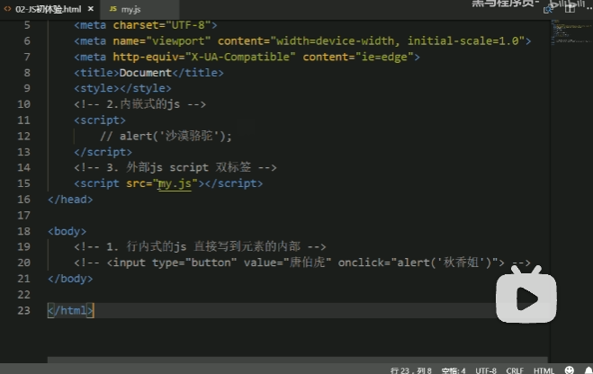
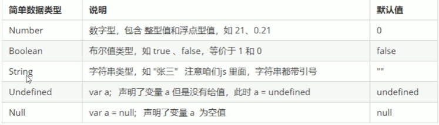

**JavaScript学习**

# 1、了解JS

## 1.1、是什么

是一种运行在客户端（浏览器）的编程语言，实现人机交互效果。

## 1.2、可以干什么

1. 网页特效 (监听用户的一些行为让网页作出对应的反馈) 
2. 表单验证 (针对表单数据的合法性进行判断) 
3. 数据交互 (获取后台的数据, 渲染到前端) 
4. 服务端编程 (node.js) 

## 1.3、组成

1. ECMAScript:
   - 规定了js基础语法核心知识。 比如：变量、分支语句、循环语句、对象等等
2. Web APIs :
   -  DOM 操作文档，比如对页面元素进行移动、大小、添加删除等操作 
   -  BOM 操作浏览器，比如页面弹窗，检测窗口宽度、存储数据到浏览器等等

# 2、JS代码规范与语法

## 2.1、JS书写的位置

1. 内部JS
   - 直接写在html文件里，用script标签包住 
   - 规范：script标签写在上面 
   - 拓展： alert(‘你好，js’) 页面弹出警告对话框
2. 外部JS
   - 代码写在以.js结尾的文件里 
   - 语法：通过script标签，引入到html页面中。
3. 嵌入式JS
   - 直接写在html文件里，用script标签包住 
   - 规范：script标签写在上面 
   - 拓展： alert(‘你好，js’) 页面弹出警告对话框



## 2.2、与c语言相同的语法

### 2.2.1、注释

## 2.3、与c语言不相同的语法

### 2.3.1、输入输出语法

- 输出

  ```
  alert(msg)//浏览器弹出警示框
  ```

- 打印到后台

  ```
  console.log(msg)//浏览器控制台打印输出信息
  ```

- 输入

  ```
  prompt(into)//浏览器弹出输入框，用户可以输入
  ```

### 2.3.2、变量

- 声明

  ```
  var 变量名
  ```

- 变量的数据类型是变化的，其他操作与c语言一致

- 有数据类型但是可以自由赋值

  

- 数字前面加0表示八进制0x表示16进制

- 数字有最大值和最小值

  ```
  Number.MAX_VALUE
  Number.MIN_VALUE
  ```

- 无穷大与无穷小以及非数值

  ```
  Infinity
  -Infinity
  NaN
  ```

### 2.3.3、判断是否为数字

```
isNaN()
```

### 2.3.4、字符串的长度

```
var str='my';
var len=str.length
```

### 2.3.5、字符串的拼接

- 用'+'号拼接

